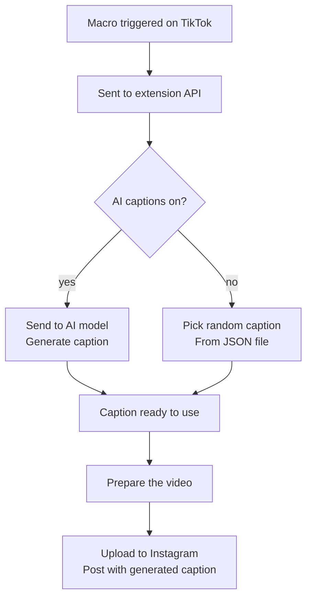

# todo
### insta handling
[ ] logintoinsta.py
[ ] created the app in fb
[ ] uploadvideo.py
[ ] add AI caption generation flow with API-key-backed provider wiring
### tiktok handling

```mermaid
graph TD;
    A[Macro triggered on TikTok] --> B[Sent to extension API]
    B --> C{AI captions on?}
    C -->|yes| D[Send to AI model\nGenerate caption]
    C -->|no| E[Pick random caption\nFrom JSON file]
    D --> F[Caption ready to use]
    E --> F
    F --> G[Prepare the video]
    G --> H[Upload to Instagram\nPost with generated caption]
```
